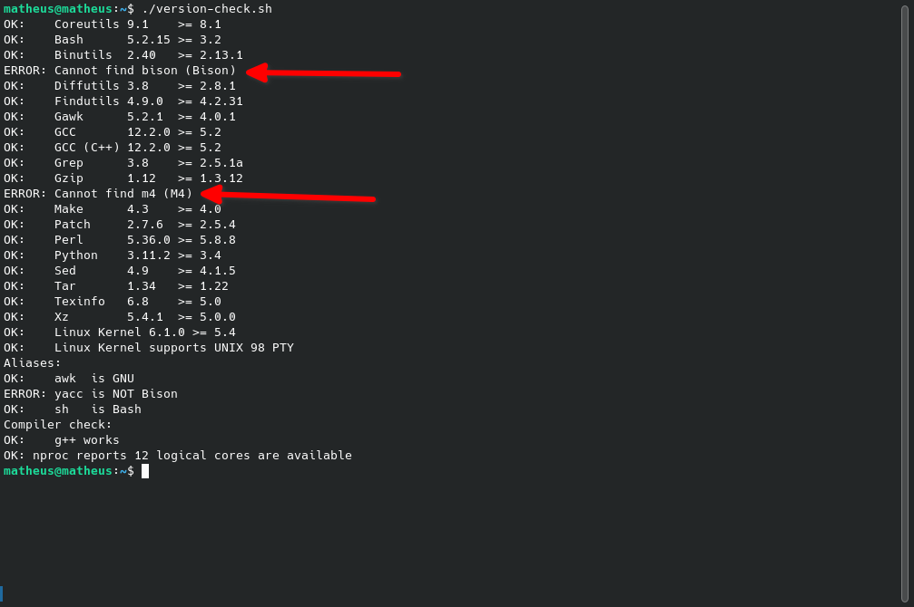
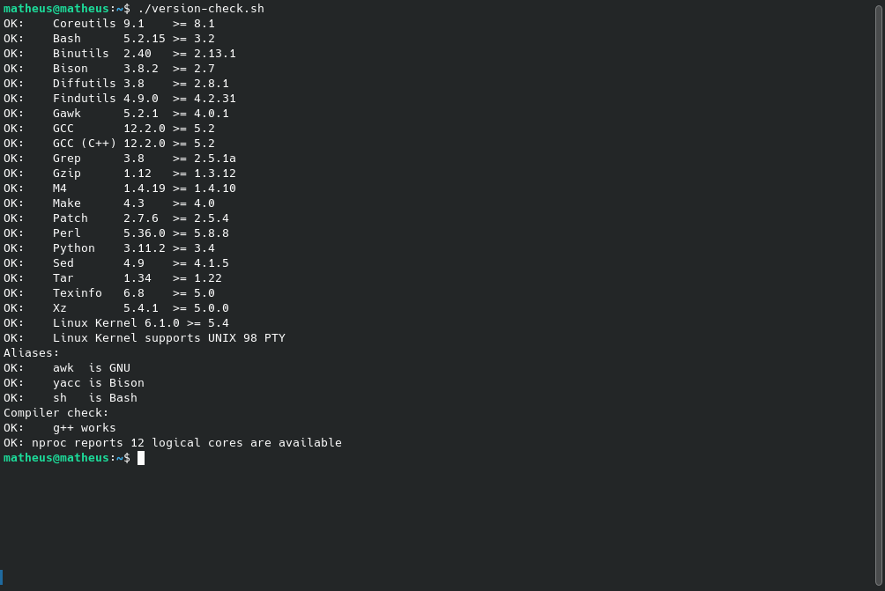

# Requisitos do Sistema Host

Antes de iniciar o desenvolvimento da nossa distribuição Linux, é fundamental garantir que o sistema host (sistema usado para construir nossa distribuição) atenda a todos os requisitos necessários. Isso inclui a instalação de ferramentas essenciais que facilitarão o processo.

## Verificação dos Requisitos

O site do [Linux From Scratch](https://www.linuxfromscratch.org/lfs/view/stable/chapter02/hostreqs.html) fornece um script em shell (`sh`) que permite verificar se o sistema host possui todas as ferramentas necessárias. Caso alguma ferramenta esteja ausente, será necessário instalá-la antes de prosseguir.

## Localização e Execução do Script

Você pode encontrar o script `sh` na pasta `code`, localizada neste mesmo diretório. Certifique-se de executá-lo para validar o ambiente antes de continuar com o projeto.

### Como Executar o Script

1. Crie o arquivo `version-check.sh` com o conteúdo do script fornecido no site:
   ```bash
   cat > version-check.sh << "EOF"
   # Aqui você deve copiar o conteúdo do script encontrado no site
   EOF
   ```

2. Torne o script executável:
   ```bash
   chmod +x version-check.sh
   ```

3. Execute o script no terminal:
   ```bash
   ./version-check.sh
   ```

Revise a saída do script para identificar possíveis ferramentas ausentes e instale-as antes de prosseguir.

### Instalando Dependências

Caso o script identifique dependências ausentes, será necessário instalá-las. Abaixo está um exemplo de como o script pode indicar dependências pendentes:



Após instalar todas as dependências, execute novamente o script. Se todas as ferramentas estiverem presentes, a saída será semelhante a esta:



## Resolvendo Problemas no Debian 12

Se você estiver utilizando o Debian 12 como sistema host, pode encontrar um problema relacionado ao link simbólico do `sh`. Nesse caso, será necessário criar o link simbólico manualmente.

### Criando o Link Simbólico para o `sh`

1. Crie o link simbólico apontando para o `bash`:
   ```bash
   sudo ln -sf /bin/bash /bin/sh
   ```

2. Verifique se o link foi criado corretamente:
   ```bash
   ls -l /bin/sh
   ```

   A saída esperada deve ser semelhante a:
   ```
   lrwxrwxrwx 1 root root 4 jan 1 12:00 /bin/sh -> bash
   ```

3. Após criar o link simbólico, execute novamente o script `version-check.sh` para garantir que todas as ferramentas necessárias estão presentes no sistema host.

Seguindo esses passos, você estará pronto para continuar com o desenvolvimento da sua distribuição Linux.