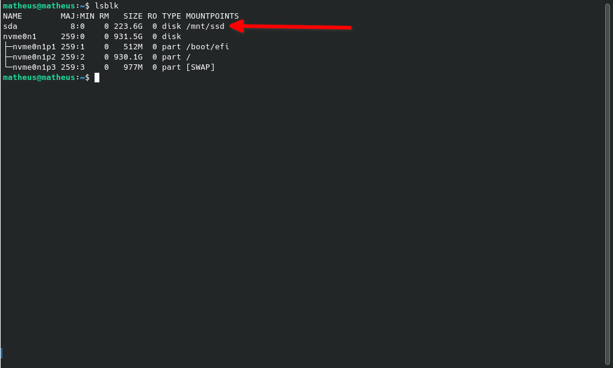

# Configurando o Sistema Host 

Neste passo, vamos criar uma nova partição no disco que servirá como ponto de partida para a criação da nossa distribuição Linux From Scratch (LFS). Você pode optar por criar uma nova partição no disco do sistema host ou utilizar um disco externo, dependendo do seu ambiente. Neste exemplo, será utilizado um SSD antigo onde vamos construir nossa distro.

É recomendado que essa partição tenha, no mínimo, **30 GB** de espaço disponível. Caso você pretenda seguir para o BLFS (Beyond Linux From Scratch), que é o processo posterior à criação da distribuição, é interessante ter no mínimo **50 GB** de espaço disponível. O BLFS inclui a implementação de configurações adicionais, como a instalação de uma interface gráfica e outros recursos. Para mais informações sobre o BLFS, acesse o link oficial: [Beyond Linux From Scratch](https://www.linuxfromscratch.org/blfs/).

### Listando Dispositivos de Armazenamento

Você pode listar todos os dispositivos de armazenamento na sua máquina usando o seguinte comando no terminal:

```bash
sudo lsblk
```

Isso retornará algo como:



### Criando e Formatando a Partição

No meu caso, precisei deletar algumas partições existentes para criar uma nova partição e formatá-la. Você pode fazer isso utilizando o `fdisk`.

#### Passo 1: Abrir o `fdisk`
Use o comando abaixo, substituindo `nome_do_disco` pelo disco correto (exemplo: `/dev/sda`):

```bash
sudo fdisk /dev/nome_do_disco
```

> **Atenção:** Certifique-se de selecionar o disco correto, pois todos os dados serão apagados!

#### Passo 2: Deletar Partições Existentes
No `fdisk`, você pode apagar partições existentes utilizando o comando `d`. Caso existam várias partições, o programa exibirá uma lista para que você escolha qual deseja deletar.

#### Passo 3: Criar uma Nova Partição
Após deletar as partições antigas (se necessário), crie uma nova partição utilizando o comando `n` e siga as instruções exibidas na tela.

#### Passo 4: Formatar a Partição
Para formatar a partição, utilize o comando `mkfs`. É recomendado usar o sistema de arquivos `ext4`. Execute o seguinte comando no terminal:

```bash
sudo mkfs.ext4 /dev/nome_do_disco
```

### Montando a Partição

Agora, para montar a partição, siga os passos abaixo:

1. Crie um diretório para o ponto de montagem:

   ```bash
   sudo mkdir /mnt/ssd
   ```

2. Monte a partição no diretório criado:

   ```bash
   sudo mount /dev/nome_do_disco /mnt/ssd
   ```

Pronto! Agora a partição está formatada e montada.

### Configurando Montagem Automática com o `fstab`

Para garantir que a partição seja montada automaticamente toda vez que você reiniciar/desligar o computador, siga os passos abaixo:

1. Verifique o UUID da partição com o comando:

   ```bash
   sudo blkid /dev/nome_da_particao
   ```

   O retorno será algo como:

   ```
   /dev/sdb1: UUID="1234-abcd-5678-efgh" TYPE="ext4" PARTUUID="abcd1234-56ef"
   ```

   Copie o valor do `UUID` exibido.

2. Edite o arquivo `/etc/fstab` para adicionar a configuração da partição:

   ```bash
   sudo nano /etc/fstab
   ```

3. Adicione a seguinte linha ao final do arquivo:

   ```
   UUID=1234-abcd-5678-efgh  /mnt/ssd  ext4  defaults  0  2
   ```

   > Substitua `1234-abcd-5678-efgh` pelo UUID da sua partição e ajuste o caminho de montagem (`/mnt/ssd`) conforme necessário.

4. Salve e saia do editor.

5. Teste a configuração do `fstab` sem reiniciar, utilizando o comando:

   ```bash
   sudo mount -a
   ```

   Se não houver erros, a configuração está correta.

Pronto! Agora sua partição será montada automaticamente em cada inicialização.

> **Dica:** Caso tenha dúvidas ou encontre problemas, recomendo consultar fóruns e artigos na internet para obter mais informações.